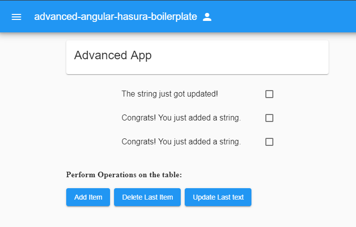

# Angular-Hasura-Boilerplate - advanced

This boilerplate is build upon the `basic` boilerplate which contained the basic set up for the Apollo Client and examples for mutations queries and subscriptions.
In this boilerplate we'll be getting around the integrating Auth0 authentication with the basic app.

## Pre-requisites

Headout to [Auth0 website](https://auth0.com/) and follow their [Build a Collaborative Realtime Todo App](https://auth0.com/blog/building-a-collaborative-todo-app-with-realtime-graphql-using-hasura/) article, up to the point of configuring the React app.  We will be replacing the React app with this Angular boilerplate.

You can find copies of the rules configured in Auth0 under the [auth0/rules](auth0/rules/) folder.  
[hasura-user-sync](auth0/rules/hasura-user-sync.js) contains an `https://<yourdomain>.herokuapp.com/v1/graphql` string that you will need to change to match your GraphQL endpoint.

### Integrating your application

After setting up your application in Auth0, you are now ready to define the environment settings for your Angular application to integrate with your GraphQL endpoint and the application defined in Auth0 for its authentication.

Edit the `src/environments/environment.ts` and `src/environments/environment.prod.ts` files 
to include your GraphQL endpoint and the relevant settings from Auth0.

## Building the Angular boilerplate

Now install the npm packages used by the boilerplate.

```
$ npm install
```

Once all the dependencies are installed, you're ready to go!

```
$ npm start
```

This builds the boilerplate code, then starts the development server at http://localhost:4200

## What's happening under the hood?

The `login` button fires a `login()` function defined in `AuthenticationService.ts` this redirects your application to Auth0 servers where it logs in the user and calls back to the user application with the user info like `user id` and `token`.

This `token` and `user id` are now saved in the local storage and are used to maintain sessions and the function `handleAuthentication()` in the `app.components.ts` file is called.

## Screenshots

#### Login Screen


#### Dashboard

